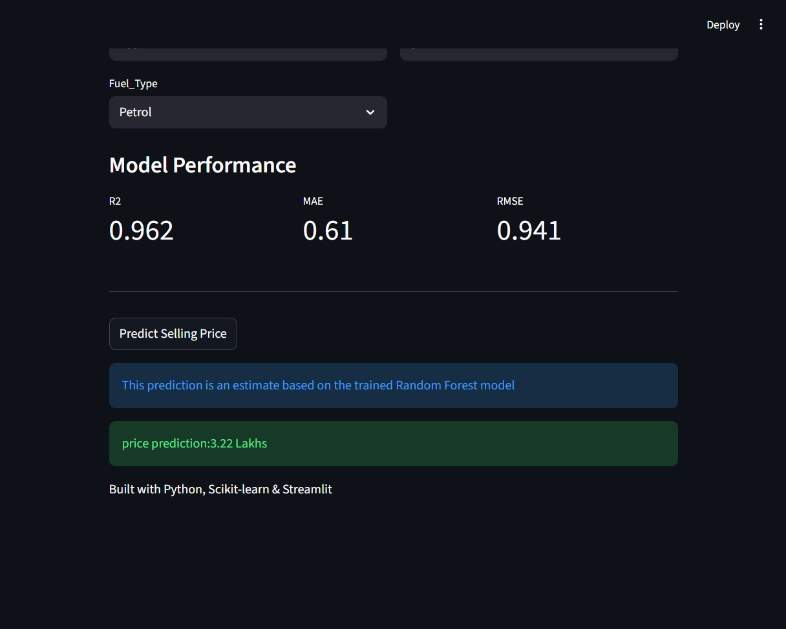

# 🚗 Car Price Prediction with ML
## 🖥️ Application Screenshot




A machine learning project that predicts the selling price of used cars based on features such as year, present price, kilometers driven, fuel type, seller type, transmission, and previous owners.

The project compares multiple regression algorithms and uses a tuned Random Forest Regressor as the final model. A Streamlit web application allows users to enter car details and get a predicted selling price.

---

## 📌 Project Overview

This project demonstrates a complete machine learning workflow:

- Data loading and exploration
- Data preprocessing
- Categorical feature encoding
- Train-test splitting
- Feature scaling
- Regression model training
- Model evaluation
- Cross-validation
- Hyperparameter tuning using GridSearchCV
- Feature importance analysis
- Model saving using Joblib
- Streamlit web application
- Git and GitHub version control

---

## 🛠️ Technologies Used

- **Python**
- **Pandas**
- **NumPy**
- **Matplotlib**
- **Scikit-learn**
- **Joblib**
- **Streamlit**
- **Jupyter Notebook**
- **Git & GitHub**

---

## 📊 Dataset

The project uses a car dataset containing information about used cars.

### Features

| Feature | Description |
|---|---|
| Year | Year of manufacture |
| Present_Price | Current/ex-showroom price of the car |
| Kms_Driven | Kilometers driven |
| Fuel_Type | Petrol, Diesel, or CNG |
| Seller_Type | Dealer or Individual |
| Transmission | Manual or Automatic |
| Owner | Number of previous owners |

### Target

**Selling_Price** — the predicted selling price of the car in lakhs.

---

## 🔄 Machine Learning Workflow

```text
Dataset
   ↓
Data Exploration
   ↓
Data Preprocessing
   ↓
Categorical Encoding
   ↓
Train/Test Split
   ↓
StandardScaler
   ↓
Model Training
   ↓
Model Evaluation
   ↓
Cross Validation
   ↓
GridSearchCV
   ↓
Best Random Forest Model
   ↓
Model Saving
   ↓
Streamlit Prediction App
